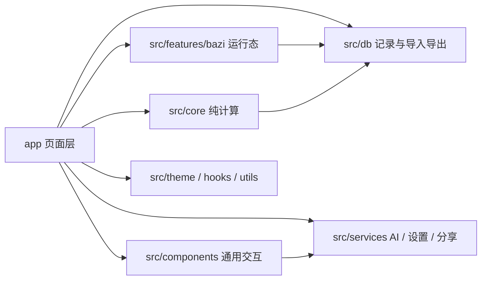

# 见机 (Jianji) 项目架构文档

本文档以当前仓库源码为准，描述真实运行入口、目录职责、关键数据模型、跨模块链路、兼容策略与当前开发边界。若与旧 README、历史截图或早期讨论不一致，以当前代码实现为准。

## 1. 项目定位

「见机」当前是一个双引擎易学排盘应用：

- 六爻排盘
- 八字排盘

它不是单纯算法仓库，而是一个完整客户端产品：

`输入 -> 纯计算 -> 展示 -> 本地记录 -> 收藏/删除 -> 备份恢复 -> AI 辅助`

应用层面已经形成三条主线：

- 排盘与结果查看
- 历史、备份、恢复
- AI 对话与结果复用

## 2. 技术基线与运行配置

### 2.1 技术栈

- Expo SDK 54
- React Native 0.81
- React 19
- TypeScript 5.9
- Expo Router
- `expo-sqlite`
- `@react-native-async-storage/async-storage`
- `react-native-sse`
- `react-native-svg`
- `tyme4ts@1.4.4`

### 2.2 App 配置

关键配置分布在：

- `package.json`
  - 运行入口：`expo-router/entry`
- `app.json`
  - 应用名：`见机`
  - `slug`: `jianji`
  - `newArchEnabled: true`
  - iOS / Android 包名：`com.jianji.app`
  - EAS Update 已接入
- `metro.config.js`
  - 为 Web 端 SQLite 增补 `wasm` 资源扩展
- `eas.json`
  - 定义 `development / preview / production` profile

说明：

- `app.json.userInterfaceStyle` 虽然仍是 `dark`，但应用内部实际视觉主题由 `ThemeContext` 控制
- 仓库内部仍保留历史命名：
  - npm 包名 `liuyao-app`
  - SQLite 文件名 `liuyao.db`

## 3. 启动链路

实际启动链路如下：

1. `package.json` 指向 `expo-router/entry`
2. `app/_layout.tsx`
   - `SplashScreen.preventAutoHideAsync()`
   - 挂载 `ThemeProvider`
   - 挂载 `SafeAreaProvider`
   - 挂载 `CustomAlertProvider`
   - 初始化根 `Stack`
3. `app/(tabs)/_layout.tsx`
   - 定义首页、学习、历史、设置四个主 Tab

根布局会等待主题加载完成后再渲染应用，因此首屏颜色不会先闪默认主题再切换。

## 4. 路由结构

### 4.1 总览

| 路由文件 | 路径 | 职责 |
| --- | --- | --- |
| `app/(tabs)/index.tsx` | `/` | 首页，六爻与八字双入口 |
| `app/(tabs)/learn.tsx` | `/learn` | 学习页入口 |
| `app/(tabs)/history.tsx` | `/history` | 多引擎历史页 |
| `app/(tabs)/settings.tsx` | `/settings` | 主题、AI 配置、备份恢复 |
| `app/learn/hexagrams.tsx` | `/learn/hexagrams` | 六十四卦资料库 |

### 4.2 六爻链路

| 路由文件 | 路径 | 职责 |
| --- | --- | --- |
| `app/divination/time.tsx` | `/divination/time` | 时间起卦 |
| `app/divination/coin.tsx` | `/divination/coin` | 硬币起卦 |
| `app/divination/number.tsx` | `/divination/number` | 数字起卦 |
| `app/divination/manual.tsx` | `/divination/manual` | 手动起卦 |
| `app/result/[id].tsx` | `/result/[id]` | 六爻结果页 |

六爻结果页支持：

- 基础排盘查看
- 动爻详情
- 卦象抽屉（互卦 / 错卦 / 综卦）
- 收藏 / 删除
- Markdown 导出
- AI 对话

### 4.3 八字链路

| 路由文件 | 路径 | 职责 |
| --- | --- | --- |
| `app/bazi/input.tsx` | `/bazi/input` | 八字输入页，同时承担新建与修改 |
| `app/bazi/result/[id].tsx` | `/bazi/result/[id]` | 八字结果页 |

八字结果页分为三段：

- 基本信息
- 基本排盘
- 专业细盘

专业细盘又分两种面板：

- `fortune`
  - 大运 / 流年 / 流月 / 小运联动
- `taiming`
  - 胎元 / 命宫 / 身宫延展视图

### 4.4 路由兜底行为

- 六爻结果页读到八字记录时，会跳转到 `/bazi/result/[id]`
- 八字结果页读到六爻记录时，会跳转到 `/result/[id]`

这让历史页可以只按记录 `id` 跳详情，而不必担心旧链接或错误入口。

## 5. 分层设计

项目可以按 8 层理解：

1. 页面层：`app/`
2. 组件层：`src/components/`
3. 纯计算核心层：`src/core/`
4. 八字业务运行态层：`src/features/bazi/`
5. 持久化层：`src/db/`
6. 服务层：`src/services/`
7. 主题 / Hook / 工具层：`src/theme/`、`src/hooks/`、`src/utils/`
8. 静态数据层：`src/data/`

对应关系：



## 6. 核心数据模型

### 6.1 六爻结果：`PanResult`

定义位置：`src/core/liuyao-calc.ts`

主要字段：

- 标识：`id`、`createdAt`
- 来源：`method`、`question`
- 时间：`solarDate`、`solarTime`、`trueSolarTime`
- 地点：`location`、`longitude`
- 历法：`lunarInfo`、`jieqi`
- 四柱：`yearGanZhi` 到 `hourGanZhi`
- 排盘主体：
  - `benGua`
  - `benGuaYao`
  - `bianGua`
  - `bianGuaYao`
  - `movingYaoPositions`
  - `rawYaoValues`
- AI：`aiAnalysis`、`aiChatHistory`、`quickReplies`

补充点：

- 每个爻位 `YaoDetail` 已经带好六亲、六神、世应、动静、变爻信息
- 缺失六亲时还会挂载 `fuShen`

### 6.2 八字结果：`BaziResult`

定义位置：`src/core/bazi-types.ts`

主要字段：

- 标识：`id`、`createdAt`、`calculatedAt`
- 时间：`solarDate`、`solarTime`、`trueSolarTime`、`timeMeta`
- 输入语义：`gender`、`longitude`、`schoolOptionsResolved`
- 本命结构：
  - `fourPillars`
  - `shiShen`
  - `cangGan`
  - `pillarMatrix`
  - `baseInfo`
  - `jieQiContext`
  - `yuanMing`
- 运势结构：
  - `childLimit`
  - `daYun`
  - `liuNian`
  - `xiaoYun`
  - `currentDaYunIndex`
- 神煞：
  - `shenSha`
  - `shenShaV2`
- AI 运行态：
  - `aiAnalysis`
  - `aiChatHistory`
  - `quickReplies`
  - `aiConversationStage`
  - `aiVerificationSummary`
  - `aiConversationDigest`
  - `aiContextSnapshot`

### 6.3 AI 消息：`PersistedAIChatMessage`

定义位置：`src/core/ai-meta.ts`

字段：

- `role`
- `content`
- `hidden?`
- `requestContent?`

`requestContent` 的作用是保存真正发给模型的文本，避免界面展示文案与模型输入文案不一致时，重试会丢失上下文。

典型场景：

- 八字快捷追问会把短句重写成内部 follow-up prompt
- “重试上一问”必须重放重写后的请求

### 6.4 统一记录 envelope

定义位置：`src/db/record-types.ts`

```ts
{
  engineType: 'liuyao' | 'bazi',
  result: PanResult | BaziResult,
  summary?: {
    method?: string;
    question?: string;
    title?: string;
    subtitle?: string;
  }
}
```

它是当前历史页、导入导出、备份恢复、保存接口的统一边界。

### 6.5 备份文件结构

设置页导出的备份载荷实际是：

```ts
{
  version: 2,
  timestamp: string,
  settings: {
    apiUrl: string,
    apiKey: '',
    model: string,
  },
  meta: {
    apiKeyIncluded: false,
  },
  records: DivinationRecordEnvelope[],
}
```

注意：

- 导出时会主动清空 `apiKey`
- 恢复设置时使用“非空字段覆盖”策略，不会因为备份不含 Key 而抹掉本机已有 Key

## 7. 纯计算核心层：`src/core/`

### 7.1 六爻

入口函数：

- `divinateByTime()`
- `divinateByCoin()`
- `divinateByNumber()`
- `divinateManual()`

它们最终统一进入 `calculatePan()`。

`calculatePan()` 负责：

1. 根据地点决定是否使用真太阳时修正
2. 计算农历、节气、四柱、纳音
3. 组装本卦、变卦、动爻
4. 计算六神、六亲、世应、伏神
5. 生成 `PanResult`

### 7.2 八字

入口函数：`calculateBazi()`

核心步骤：

1. 归一化输入参数
2. 按本地钟表时 / 平太阳时 / 真太阳时换算实际排盘时间
3. 选择子时口径对应的 `EightCharProvider`
4. 提取四柱、十神、藏干
5. 计算起运、大运、流年、流月、小运
6. 计算元命、胎元、命宫、身宫、人元司令等扩展信息
7. 构建 `shenShaV2`
8. 回填兼容版 `shenSha`
9. 组装 `pillarMatrix`、`baseInfo`、`jieQiContext`
10. 构建 `BaziResult`

### 7.3 八字 ID 设计

`calculateBazi()` 会基于以下信息构造稳定 ID：

- 输入出生时间
- 计算后的排盘时间
- 参考时点
- 性别
- 经度
- 子时口径
- 时间口径

因此：

- 只改姓名这类展示字段时，ID 可能不变
- 改出生时间、地点或口径时，ID 往往会变化
- 结果页编辑保存时需要 `replaceRecord(oldId, newEnvelope)` 来覆盖旧记录并继承收藏状态

## 8. 八字业务运行态：`src/features/bazi/`

### 8.1 `view-model.ts`

职责：

- 把 `BaziResult` 映射成结果页可直接消费的视图模型
- 负责专业细盘两套面板：
  - `fortune`
  - `taiming`
- 将四柱、大运、流年、流月、特殊列统一为 `ProChartColumnView / ProChartRowView`

### 8.2 `edit-helpers.ts`

职责：

- 从 `BaziResult` 反推输入页表单状态
- 尝试按出生地名称或经度回匹配 `CityInfo`
- 匹配失败时保留 `locationFallbackLabel`

### 8.3 `pending-result-cache.ts`

这是八字链路非常重要的一层。

行为：

1. 输入页排盘完成后，不先等落库
2. 先把结果放进内存 `Map`
3. 结果页优先消费 pending 结果
4. 后台异步落库
5. 落库成功后标记 `saved`
6. 落库失败后展示 `error` 并提供重试

特点：

- 提升“计算后立即可见”的体感
- 只存在于内存，不是长期存储

## 9. 持久化层：`src/db/`

### 9.1 存储后端

- Native：`expo-sqlite`
- Web：`localStorage`

统一导出接口：

- `saveRecord`
- `replaceRecord`
- `getAllRecords`
- `getRecord`
- `deleteRecord`
- `toggleFavorite`
- `exportAllRecords`
- `importRecords`

### 9.2 Native SQLite

表：`records`

关键字段：

- `id`
- `created_at`
- `engine_type`
- `method`
- `question`
- `title`
- `subtitle`
- `gua_name`
- `bian_gua_name`
- `full_result`
- `is_favorite`

说明：

- `gua_name / bian_gua_name` 仍被保留，用于兼容旧结构
- `ensureNativeSchema()` 会补齐新增字段并修复旧数据

### 9.3 Web localStorage

当前键：

- `divination_records_v2`

历史键：

- `liuyao_records`

Web 端会在首次读取时自动把旧六爻结构迁移到 v2。

### 9.4 导入策略

导入层分成两部分：

- `import-validation.ts`
  - 校验 v2 envelope
  - 兼容 v1 直接导出的六爻 `PanResult`
- `import-strategy.ts`
  - 决定 `insert / update / skip`

UI 侧目前使用：

- `mode = merge`
- 冲突策略由用户在预览弹窗里选择：
  - `skip`
  - `replace`

虽然底层也支持 `mode = replace`，但当前设置页 UI 没有直接暴露整库覆盖导入。

## 10. 页面级业务流

### 10.1 六爻起卦流

1. 页面采集输入
2. 可选读取 `useLocation()` 中持久化的城市
3. 调用六爻计算函数
4. `saveRecord({ engineType: 'liuyao', result })`
5. 跳转 `/result/[id]`

### 10.2 八字新建流

1. 进入 `/bazi/input`
2. 录入出生信息、地点与口径
3. 调用 `calculateBazi()`
4. 先 `primePendingBaziRecord()`
5. 立即跳转 `/bazi/result/[id]`
6. 后台异步落库 `saveRecord()`

### 10.3 八字编辑流

1. 结果页点击三点菜单中的“修改内容”
2. 跳到 `/bazi/input?editId=...`
3. 输入页通过 `getRecord()` 或 pending cache 回填旧结果
4. `buildBaziEditFormState()` 反推表单状态
5. 重算后：
   - 同 ID：直接 `saveRecord`
   - 新 ID：`replaceRecord(oldId, envelope)`，保留收藏状态

### 10.4 历史页

历史页当前只保存以下筛选状态到 `AsyncStorage`：

- `activeEngine`
- `liuyaoCategory`
- `baziCategory`

说明：

- 关键词不会持久化
- 引擎切换与分类切换会在下次打开时恢复

### 10.5 学习页

学习页完全依赖本地 JSON 数据：

- `iching.json`
- `ichuan/tuan.json`
- `ichuan/xiang.json`
- `ichuan/wen.json`

因此：

- 不依赖网络
- 当前只覆盖六十四卦资料，不涉及八字知识库

## 11. AI 架构

### 11.1 配置来源

`src/services/settings.ts` 负责持久化：

- `apiUrl`
- `apiKey`
- `model`

默认值：

- `https://api.openai.com/v1/chat/completions`
- `gpt-4o`

设置读写时会清理历史 Prompt 键，说明当前 Prompt 已完全内建，不再暴露给用户编辑。

### 11.2 请求形态

AI 层分成两类调用：

- 流式主会话：`analyzeWithAIChatStream()`
  - 基于 `react-native-sse`
  - 用于用户真正看到的对话输出
- 非流式辅助调用：`requestChatCompletion()`
  - 用于生成快捷追问和八字 digest

### 11.3 六爻 AI

六爻使用 `buildSystemMessage()` 构造完整盘面上下文，系统消息内已经包含：

- 时间与真太阳时
- 节气、月将、月相
- 四柱
- 本卦 / 变卦 / 互错综
- 六爻明细
- 动爻
- 占问事项

会话结束后可异步生成：

- `quickReplies`

### 11.4 八字 AI

八字模式共用 `AIChatModal`，但额外叠加了严格阶段机：

- `foundation_pending`
- `foundation_ready`
- `verification_ready`
- `followup_ready`

工作流顺序：

1. 基础定局
2. 前事核验
3. 未来五年
4. 后续专题追问

阶段结束依赖模型返回标记：

- `[[BAZI_STAGE:FOUNDATION_DONE]]`
- `[[BAZI_STAGE:VERIFICATION_DONE]]`
- `[[BAZI_STAGE:FIVE_YEAR_DONE]]`

如果缺少标记或结构不达标：

- 该阶段不会被视为完成
- 会提示重试当前阶段

### 11.5 八字 AI 的额外运行态

八字还多了三个关键机制：

1. `aiContextSnapshot`
   - 锁定当时专业细盘上下文
   - 避免用户切换面板后，后续 AI 解盘基线漂移
2. `aiConversationDigest`
   - 把已经确认的格局、用忌、前事核验和未来五年主线压缩成结构化 JSON
   - 后续追问时作为 system context 复用
3. `requestContent`
   - 记录真正发给模型的重写请求文本，支持“精准重试”

### 11.6 AI 产物刷新时机

并不是每次回复都刷新 digest / 快捷追问。

规则：

- 六爻：回复后可生成快捷追问
- 八字：只有进入 `followup_ready` 之后，才开始生成 digest 与快捷追问

这样做是为了避免基础定局和前事核验阶段尚未稳定时，过早固化摘要。

## 12. 主题、地点与公共状态

### 12.1 主题系统

`ThemeContext.tsx` 负责：

- 从 `AsyncStorage(app-theme)` 读取主题
- 提供 `theme / setTheme / Colors`
- 在主题完成加载前阻塞根渲染

当前四套主题：

- `dark`
- `green`
- `white`
- `purple`

### 12.2 八字语义色

`bazi-theme.ts` 基于基础主题派生 `Colors.bazi.*` 语义 token，包括：

- chrome
- hero
- action
- infoBand
- trackActive
- warning

作用：

- 八字结果页不再硬编码颜色
- 主题切换能稳定影响头区、信息带、选中轨道、警示态等区域

### 12.3 地点选择

地点相关能力分成两种：

- 六爻页面
  - 复用 `useLocation() + LocationBar + CityPicker`
  - 通过 `AsyncStorage(settings_location)` 持久化最近一次选城
- 八字输入页
  - 复用 `LocationBar + CityPicker`
  - 城市状态直接挂在表单里，不复用六爻那条持久化状态

注意：

- 六爻地点是“可选校时”
- 八字在平太阳时 / 真太阳时模式下，地点是必填计算条件

## 13. 兼容与迁移

### 13.1 八字旧记录兼容

`normalizeBaziResultV2()` 会对历史八字记录做补全，包括：

- 神煞别名统一
- `shenShaV2` 补全
- `ganZhiBuckets` 重建
- 人元司令明细回填
- 交运规则明细回填
- `schoolOptionsResolved` 默认值修正
- 老阶段名向新阶段名映射
- AI formatter context 结构规范化

因此页面层优先消费 normalize 后的结果，而不是直接假定所有字段都齐全。

### 13.2 设置兼容

读取 AI 设置时会移除：

- 旧六爻 Prompt 键
- 旧八字 Prompt 键
- 更早期统一 Prompt 键

这代表当前产品不再维护“用户自定义系统提示词”这条旧配置链路。

## 14. 当前开发现状与风险

### 14.1 已建立的质量约束

- TypeScript `strict`
- 记录导入校验
- 八字结果 normalize
- AI 阶段完成标记校验
- 存储层对旧结构的显式迁移

### 14.2 目前仍然缺少的基线

- 仓库已配置 Jest，但当前没有自动化测试文件
- 类型检查、导出检查没有包装成 npm script
- AI 质量依赖外部模型，客户端只能做结构和流程约束，不能保证模型内容绝对稳定

### 14.3 需要开发者额外注意的点

- 八字 pending cache 是内存态，不能把它当作长期状态源
- 结果页与 AI 层都可能读 pending 结果和数据库结果两套来源
- 文档里提到的“支持”需要区分：
  - UI 是否暴露
  - 底层 API 是否已实现

例如导入层已经支持 `replace` 模式，但当前设置页 UI 只开放 `merge + skip/replace conflict policy`。

## 15. 文档结论

当前项目最值得把握的架构事实有三条：

1. 它已经是六爻与八字共存的多引擎客户端，而不是六爻工具加一个八字实验页
2. 八字链路的核心价值不只在算法本身，还在 `pending cache + view-model + AI workflow + normalize compatibility`
3. 存储、备份、历史、AI 都已经围绕统一 envelope 建立起了产品级闭环

如果后续继续演进，最优先补的不是再堆页面，而是：

- 自动化测试基线
- 开发命令脚本化
- 更明确的导入/恢复与 AI 失败观测能力
