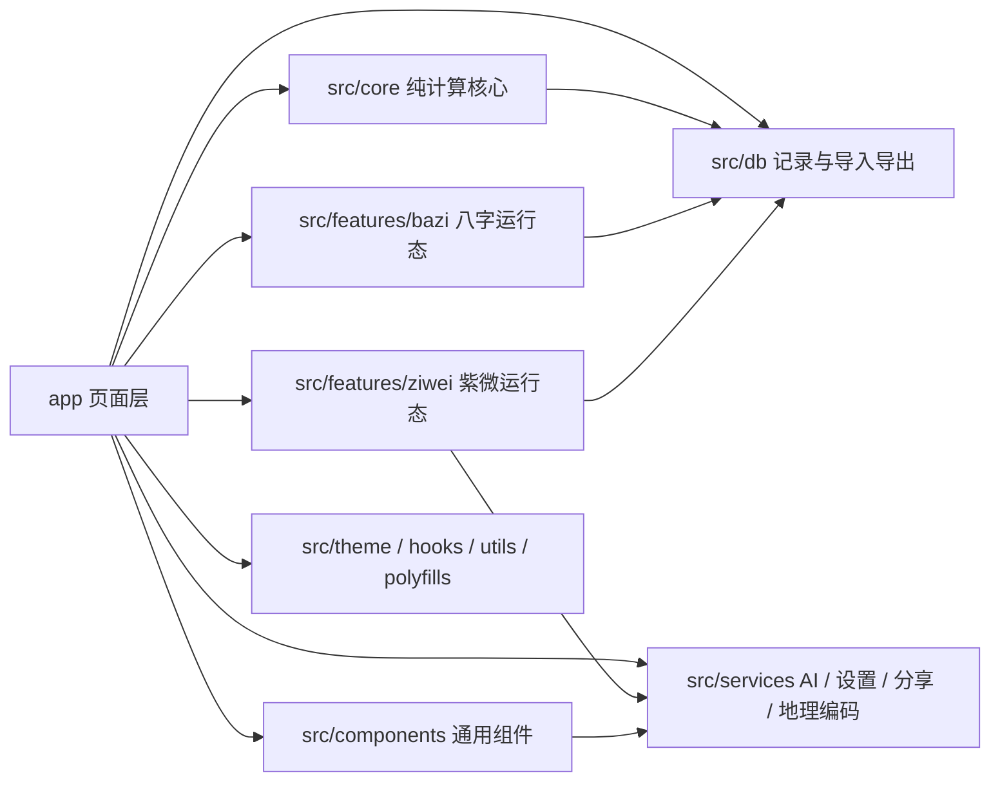

# 见机 Jianji 架构文档

见机是一款基于 Expo + React Native 构建的跨平台易学排盘应用，当前围绕六爻、八字、紫微斗数三条业务链路提供输入、计算、展示、存储、备份恢复与 AI 辅助分析能力。

产品预览见 [README.md](./README.md)。

## 1. 项目概览

项目当前包含三条核心业务链路：

- 六爻排盘
- 八字命理
- 紫微斗数

统一能力覆盖：

- 输入与排盘
- 结果展示与历史回看
- 收藏、搜索与按引擎筛选
- 备份导出与恢复导入
- AI 辅助分析、快捷追问与会话导出

## 2. 技术基线

### 2.1 主要栈

- Expo SDK 54
- React Native 0.81
- React 19
- TypeScript 5.9
- Expo Router
- `expo-sqlite`
- `@react-native-async-storage/async-storage`
- `tyme4ts@1.4.4`
- `iztro@2.5.8`
- `@province-city-china/*`
- `react-native-reanimated`
- `react-native-sse`
- `react-native-svg`
- `@formatjs/intl-pluralrules`

### 2.2 运行配置

- 入口：`package.json -> expo-router/entry`
- 应用名：`见机`
- `slug`：`jianji`
- 包名：`com.jianji.app`
- `metro.config.js` 已注册 `wasm` 资源扩展，供 Web 端 SQLite 兼容使用
- `eas.json` 包含 `development / preview / production` 三套 profile
- `app/_layout.tsx` 在根布局最先加载 `src/polyfills/intl.ts`

补充说明：

- 视觉主题由 `ThemeContext` 控制
- 仓库内部仍沿用部分历史命名：
  - npm 包名：`liuyao-app`
  - 原生数据库文件：`liuyao.db`

## 3. 启动与页面结构

### 3.1 启动链路

1. `expo-router/entry`
2. `app/_layout.tsx`
3. `app/(tabs)/_layout.tsx`

根布局负责：

- 注入 `Intl.PluralRules` polyfill
- 控制 Splash Screen 生命周期
- 注入主题、手势、Safe Area 与全局弹窗上下文
- 挂载根级 `Stack`

### 3.2 主路由

| 路由 | 页面 | 说明 |
| --- | --- | --- |
| `/` | `app/(tabs)/index.tsx` | 首页，六爻 / 八字 / 紫微三入口 |
| `/learn` | `app/(tabs)/learn.tsx` | 学习页入口 |
| `/history` | `app/(tabs)/history.tsx` | 三引擎统一历史记录 |
| `/settings` | `app/(tabs)/settings.tsx` | 主题、AI、地理编码 Key、备份与恢复 |
| `/learn/hexagrams` | `app/learn/hexagrams.tsx` | 六十四卦资料库 |

### 3.3 六爻链路

| 路由 | 页面 | 说明 |
| --- | --- | --- |
| `/divination/time` | `app/divination/time.tsx` | 时间起卦 |
| `/divination/coin` | `app/divination/coin.tsx` | 硬币起卦 |
| `/divination/number` | `app/divination/number.tsx` | 数字起卦 |
| `/divination/manual` | `app/divination/manual.tsx` | 手动起卦 |
| `/result/[id]` | `app/result/[id].tsx` | 六爻结果页 |

### 3.4 八字链路

| 路由 | 页面 | 说明 |
| --- | --- | --- |
| `/bazi/input` | `app/bazi/input.tsx` | 八字输入页，支持新建与修改 |
| `/bazi/result/[id]` | `app/bazi/result/[id].tsx` | 八字结果页 |

八字结果页包含三段视图：

- 基本信息
- 基本排盘
- 专业细盘

专业细盘支持两种面板：

- `fortune`：大运、流年、流月、小运联动
- `taiming`：胎元、命宫、身宫延展视图

### 3.5 紫微链路

| 路由 | 页面 | 说明 |
| --- | --- | --- |
| `/ziwei/input` | `app/ziwei/input.tsx` | 紫微输入页，支持新建与修改 |
| `/ziwei/result` | `app/ziwei/result.tsx` | 紫微即时结果页，按路由参数重建命盘 |
| `/ziwei/result/[id]` | `app/ziwei/result/[id].tsx` | 紫微历史记录加载器，读取存档后跳转结果页 |

紫微结果页当前包含四个顶部视图：

- `chart`：十二宫盘面与运限切换
- `pattern`：格局分析
- `palace`：宫位详解
- `info`：基本信息

运限层支持：

- `decadal`：大限
- `age`：小限
- `yearly`：流年
- `monthly`：流月
- `daily`：流日
- `hourly`：流时

## 4. 分层设计

项目可以按 9 层理解：

1. 页面层：`app/`
2. 组件层：`src/components/`
3. 纯计算核心层：`src/core/`
4. 八字运行态层：`src/features/bazi/`
5. 紫微运行态层：`src/features/ziwei/`
6. 数据持久化层：`src/db/`
7. 服务层：`src/services/`
8. 主题 / Hook / 工具 / Polyfill 层：`src/theme/`、`src/hooks/`、`src/utils/`、`src/polyfills/`
9. 静态数据与测试资源层：`src/data/`、`src/__localtests__/`



## 5. 核心数据模型

### 5.1 六爻结果：`PanResult`

定义位置：`src/core/liuyao-calc.ts`

主要字段：

- 标识：`id`、`createdAt`
- 来源：`method`、`question`
- 时间：`solarDate`、`solarTime`、`trueSolarTime`
- 地点：`location`、`longitude`
- 历法：`lunarInfo`、`jieqi`
- 四柱：`yearGanZhi`、`monthGanZhi`、`dayGanZhi`、`hourGanZhi`
- 排盘主体：`benGua`、`benGuaYao`、`bianGua`、`bianGuaYao`
- AI：`aiAnalysis`、`aiChatHistory`、`quickReplies`

### 5.2 八字结果：`BaziResult`

定义位置：`src/core/bazi-types.ts`

主要字段：

- 标识：`id`、`createdAt`、`calculatedAt`
- 时间：`solarDate`、`solarTime`、`trueSolarTime`、`timeMeta`
- 输入语义：`gender`、`longitude`、`schoolOptionsResolved`
- 本命结构：`fourPillars`、`shiShen`、`cangGan`、`pillarMatrix`、`baseInfo`、`jieQiContext`、`yuanMing`
- 运势结构：`childLimit`、`daYun`、`liuNian`、`xiaoYun`
- 神煞结构：`shenSha`、`shenShaV2`
- AI 运行态：`aiAnalysis`、`aiChatHistory`、`quickReplies`、`aiConversationStage`、`aiVerificationSummary`、`aiConversationDigest`

### 5.3 紫微结果：`ZiweiRecordResult`

定义位置：`src/features/ziwei/record.ts`

主要字段：

- 标识：`id`、`createdAt`
- 输入语义：`birthLocal`、`longitude`、`gender`、`calendarType`、`lunar`、`config`、`cityLabel`、`name`
- 真太阳时派生：`solarDate`、`trueSolarDateTimeLocal`、`trueSolarLunar`、`timeIndex`、`timeLabel`、`timeRange`
- 命盘摘要：`lunarDate`、`chineseDate`、`fiveElementsClass`、`soul`、`body`
- AI 运行态：`aiAnalysis`、`aiChatHistory`、`quickReplies`、`aiConversationDigest`、`aiConversationStage`、`aiVerificationSummary`
- 规则快照：`aiContextSnapshot`、`ruleSignature`

其中：

- `config` 描述当前门派与分界配置：算法、年界、运限界、晚子口径、天地人盘
- `ruleSignature` 绑定 prompt 种子版本、`iztro` 版本与亮度基线版本，用于判断历史记录是否仍匹配当前规则

### 5.4 统一记录 envelope

定义位置：`src/db/record-types.ts`

```ts
{
  engineType: 'liuyao' | 'bazi' | 'ziwei',
  result: PanResult | BaziResult | ZiweiRecordResult,
  summary?: {
    method?: string;
    question?: string;
    title?: string;
    subtitle?: string;
  }
}
```

统一 envelope 负责：

- 历史记录列表摘要
- 备份导出与导入恢复
- Web / SQLite 双存储兼容
- 路由页根据 `engineType` 分发到不同结果页

## 6. 纯计算核心与视图模型

### 6.1 六爻核心

六爻入口函数：

- `divinateByTime()`
- `divinateByCoin()`
- `divinateByNumber()`
- `divinateManual()`

最终统一进入 `calculatePan()`，负责：

1. 根据地点决定是否进行真太阳时修正
2. 计算农历、节气、四柱、纳音
3. 生成本卦、变卦、动爻
4. 计算六神、六亲、世应、伏神
5. 组装 `PanResult`

当前节气、月将、月相都统一基于排盘使用的 `effectiveDate` 计算。

### 6.2 八字核心

八字入口函数：`calculateBazi()`

核心步骤：

1. 归一化输入参数
2. 按本地钟表时 / 平太阳时 / 真太阳时换算排盘时间
3. 根据子时口径选择 `EightCharProvider`
4. 提取四柱、十神、藏干
5. 计算起运、大运、流年、流月、小运
6. 生成胎元、命宫、身宫、人元司令、元命等扩展信息
7. 组装 `BaziResult`

### 6.3 紫微核心

紫微计算的主要入口位于 `src/features/ziwei/iztro-adapter.ts`。

核心步骤：

1. 将输入页表单组装为 `ZiweiInputPayload`
2. 基于出生地经度与 `UTC+8` 语义计算真太阳时
3. 在公历 / 农历输入之间互转，确定 `timeIndex`、`timeLabel`、`timeRange`
4. 结合 `config` 调用 `iztro` 生成静态命盘
5. 计算大限、小限、流年、流月、流日、流时等动态运限
6. 通过 `src/features/ziwei/view-model.ts` 构建盘面、三方四正、飞化、中心面板与缩放态
7. 写入 `ZiweiRecordResult` 并可从历史记录反向恢复路由参数

### 6.4 紫微亮度基线

相关目录：`src/features/ziwei/brightness/`

当前用途：

- 为星曜亮度提供本地结构化基线
- 与 `iztro` 原始结果共同参与最终亮度标签解析
- 通过 `ZIWEI_BRIGHTNESS_BASELINE_VERSION` 写入 `ruleSignature`
- 配套覆盖 `tile-layout`、`zoom-layout`、baseline 注入等测试

## 7. 存储、导出与兼容

### 7.1 存储策略

- 原生端：`expo-sqlite`
- Web 端：`localStorage`

两端统一暴露 `saveRecord / replaceRecord / getRecord / getAllRecords / exportAllRecords / importRecords` 等接口。

### 7.2 备份格式

备份当前版本为 `version: 2`，支持：

- 六爻、八字、紫微混合导出
- 导入前结构校验与冲突预览
- 跳过重复或覆盖重复
- 导出时自动清空 `apiKey` 与 `geocoderApiKey`

### 7.3 兼容策略

- Web 端会自动迁移旧版 `liuyao_records` 到 `divination_records_v2`
- 原生 SQLite 会补齐 `engine_type`、`title`、`subtitle` 等字段
- 旧八字记录在读取、导出与导入时会先走宽松兼容归一化，再补全为当前结构
- 紫微导入记录会校验 `tzOffsetMinutes === -480`，保证当前仅接受中国标准时区语义
- 紫微导入时会过滤非法 `aiChatHistory` 项，避免旧脏数据污染当前会话
- 位置服务会把旧版城市结构归一化到新的 `RegionSelection`

## 8. AI 与服务层

### 8.1 AI 工作流

核心实现：`src/services/ai.ts` + `src/components/AIChatModal.tsx`

当前支持三类工作流：

- 六爻：直接解盘 + 连续追问
- 八字：基础定局 -> 前事核验 -> 未来五年 -> 后续追问
- 紫微：基础命盘分析 -> 前事核验 -> 今年与未来五年 -> 后续追问

AI 层职责包括：

- 为不同引擎构造系统提示词与上下文
- 通过 SSE 执行流式输出
- 检查阶段完成标记，决定是否开放下一阶段
- 生成摘要 digest 与快捷追问
- 在失败时给出可恢复信息或回退策略

### 8.2 设置与配置

`src/services/settings.ts` 当前保存：

- `apiUrl`
- `apiKey`
- `model`
- `geocoderApiKey`

同时会清理旧版 prompt / AI 解锁相关存储键，避免历史配置干扰当前逻辑。

### 8.3 地点与地理编码

- `src/services/location.ts`：保存用户已选出生地
- `src/services/region-geocode.ts`：调用腾讯位置服务补全区县经纬度，并缓存结果
- `src/core/city-data.ts`：省市区候选、旧数据兼容与显示标签构建

### 8.4 分享导出

`src/services/share.ts` 当前支持：

- 六爻结果 Markdown 导出
- 三引擎 AI 会话 Markdown 导出
- 基于不同引擎生成差异化文件名与头部摘要

## 9. 测试与文档

### 9.1 常用命令

```bash
npm install
npm run start
npm run android
npm run ios
npm run web
npm run typecheck
npm test
npm run test:ziwei
```

### 9.2 当前测试覆盖重点

- 紫微视图模型：`src/features/ziwei/view-model.test.ts`
- 紫微亮度基线：`src/features/ziwei/brightness/ziwei-brightness-baseline.test.ts`
- 紫微缩放与瓦片布局：`src/features/ziwei/brightness/tile-layout.test.ts`、`src/features/ziwei/brightness/zoom-layout.test.ts`
- AI 服务与生命周期：`src/services/ai.test.ts`、`src/components/ai-chat-lifecycle.test.ts`
- 本地回归：`src/__localtests__/`

### 9.3 文档入口

- 项目首页文档：`README.md`
- 架构文档：当前文件 `PROJECT_ARCHITECTURE.md`
- 紫微亮度基线文档：`src/features/ziwei/brightness/README.md`
