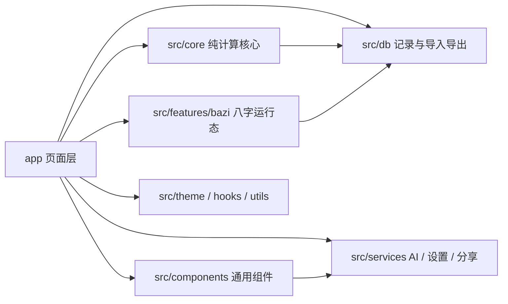

# 见机 Jianji 架构文档

见机是一款基于 Expo + React Native 构建的跨平台易学排盘应用，围绕六爻与八字提供输入、计算、展示、存储、备份恢复与 AI 辅助分析能力。

产品预览见 [README.md](./README.md)。

## 1. 项目概览

项目当前包含两条核心业务链路：

- 六爻排盘
- 八字命理

统一能力覆盖：

- 输入与排盘
- 结果展示与回看
- 历史记录与收藏
- 备份导出与恢复导入
- AI 辅助分析与会话复用

## 2. 技术基线

### 2.1 主要栈

- Expo SDK 54
- React Native 0.81
- React 19
- TypeScript 5.9
- Expo Router
- `expo-sqlite`
- `@react-native-async-storage/async-storage`
- `react-native-sse`
- `react-native-svg`
- `tyme4ts@1.4.4`

### 2.2 运行配置

- 入口：`package.json -> expo-router/entry`
- 应用名：`见机`
- `slug`：`jianji`
- 包名：`com.jianji.app`
- `metro.config.js` 已注册 `wasm` 资源扩展，供 Web 端 SQLite 兼容使用
- `eas.json` 包含 `development / preview / production` 三套 profile

补充说明：

- 视觉主题由 `ThemeContext` 控制
- 仓库内部仍沿用部分历史命名：
  - npm 包名：`liuyao-app`
  - 原生数据库文件：`liuyao.db`

## 3. 启动与页面结构

### 3.1 启动链路

1. `expo-router/entry`
2. `app/_layout.tsx`
3. `app/(tabs)/_layout.tsx`

根布局负责：

- 控制 Splash Screen 生命周期
- 注入主题、Safe Area 与全局弹窗上下文
- 挂载根级 `Stack`

### 3.2 主路由

| 路由 | 页面 | 说明 |
| --- | --- | --- |
| `/` | `app/(tabs)/index.tsx` | 首页，六爻与八字双入口 |
| `/learn` | `app/(tabs)/learn.tsx` | 学习页入口 |
| `/history` | `app/(tabs)/history.tsx` | 多引擎历史记录 |
| `/settings` | `app/(tabs)/settings.tsx` | 主题、AI、备份与恢复 |
| `/learn/hexagrams` | `app/learn/hexagrams.tsx` | 六十四卦资料库 |

### 3.3 六爻链路

| 路由 | 页面 | 说明 |
| --- | --- | --- |
| `/divination/time` | `app/divination/time.tsx` | 时间起卦 |
| `/divination/coin` | `app/divination/coin.tsx` | 硬币起卦 |
| `/divination/number` | `app/divination/number.tsx` | 数字起卦 |
| `/divination/manual` | `app/divination/manual.tsx` | 手动起卦 |
| `/result/[id]` | `app/result/[id].tsx` | 六爻结果页 |

### 3.4 八字链路

| 路由 | 页面 | 说明 |
| --- | --- | --- |
| `/bazi/input` | `app/bazi/input.tsx` | 八字输入页，支持新建与修改 |
| `/bazi/result/[id]` | `app/bazi/result/[id].tsx` | 八字结果页 |

八字结果页包含三段视图：

- 基本信息
- 基本排盘
- 专业细盘

专业细盘支持两种面板：

- `fortune`：大运、流年、流月、小运联动
- `taiming`：胎元、命宫、身宫延展视图

## 4. 分层设计

项目可以按 8 层理解：

1. 页面层：`app/`
2. 组件层：`src/components/`
3. 纯计算核心层：`src/core/`
4. 八字运行态层：`src/features/bazi/`
5. 数据持久化层：`src/db/`
6. 服务层：`src/services/`
7. 主题 / Hook / 工具层：`src/theme/`、`src/hooks/`、`src/utils/`
8. 静态数据层：`src/data/`



## 5. 核心数据模型

### 5.1 六爻结果：`PanResult`

定义位置：`src/core/liuyao-calc.ts`

主要字段：

- 标识：`id`、`createdAt`
- 来源：`method`、`question`
- 时间：`solarDate`、`solarTime`、`trueSolarTime`
- 地点：`location`、`longitude`
- 历法：`lunarInfo`、`jieqi`
- 四柱：`yearGanZhi`、`monthGanZhi`、`dayGanZhi`、`hourGanZhi`
- 排盘主体：`benGua`、`benGuaYao`、`bianGua`、`bianGuaYao`
- AI：`aiAnalysis`、`aiChatHistory`、`quickReplies`

### 5.2 八字结果：`BaziResult`

定义位置：`src/core/bazi-types.ts`

主要字段：

- 标识：`id`、`createdAt`、`calculatedAt`
- 时间：`solarDate`、`solarTime`、`trueSolarTime`、`timeMeta`
- 输入语义：`gender`、`longitude`、`schoolOptionsResolved`
- 本命结构：`fourPillars`、`shiShen`、`cangGan`、`pillarMatrix`、`baseInfo`、`jieQiContext`、`yuanMing`
- 运势结构：`childLimit`、`daYun`、`liuNian`、`xiaoYun`
- 神煞结构：`shenSha`、`shenShaV2`
- AI 运行态：`aiAnalysis`、`aiChatHistory`、`quickReplies`、`aiConversationStage`、`aiVerificationSummary`、`aiConversationDigest`

### 5.3 `BaziTimeMeta`

`BaziTimeMeta` 当前同时保存展示时间与兼容回填时间：

- `solarDate` / `solarTime`
- `trueSolarTime`
- `solarDateIso`
- `solarDateTimeIso`
- `trueSolarDateTimeIso`
- `solarDateTimeLocal`
- `trueSolarDateTimeLocal`

其中 `solarDateTimeLocal` 与 `trueSolarDateTimeLocal` 用于跨时区回填与再次排盘时保持原始墙上时间语义。

### 5.4 统一记录 envelope

定义位置：`src/db/record-types.ts`

```ts
{
  engineType: 'liuyao' | 'bazi',
  result: PanResult | BaziResult,
  summary?: {
    method?: string;
    question?: string;
    title?: string;
    subtitle?: string;
  }
}
```

历史记录、导入导出与备份恢复都围绕这一层统一边界运行。

## 6. 纯计算核心

### 6.1 六爻核心

六爻入口函数：

- `divinateByTime()`
- `divinateByCoin()`
- `divinateByNumber()`
- `divinateManual()`

最终统一进入 `calculatePan()`，负责：

1. 根据地点决定是否进行真太阳时修正
2. 计算农历、节气、四柱、纳音
3. 生成本卦、变卦、动爻
4. 计算六神、六亲、世应、伏神
5. 组装 `PanResult`

当前节气、月将、月相都统一基于排盘使用的 `effectiveDate` 计算。

### 6.2 八字核心

八字入口函数：`calculateBazi()`

核心步骤：

1. 归一化输入参数
2. 按本地钟表时 / 平太阳时 / 真太阳时换算排盘时间
3. 根据子时口径选择 `EightCharProvider`
4. 提取四柱、十神、藏干
5. 计算起运、大运、流年、流月、小运
6. 生成胎元、命宫、身宫、人元司令、元命等扩展信息
7. 组装 `BaziResult`

## 7. 存储、导出与兼容

### 7.1 存储策略

- 原生端：`expo-sqlite`
- Web 端：`localStorage`

两端统一暴露 `saveRecord / replaceRecord / getRecord / getAllRecords / exportAllRecords / importRecords` 等接口。

### 7.2 备份格式

备份当前版本为 `version: 2`，支持：

- 六爻与八字混合导出
- 导入前结构校验与冲突预览
- 跳过重复或覆盖重复
- 导出时自动清空 API Key

### 7.3 兼容策略

- Web 端会自动迁移旧版 `liuyao_records` 到 `divination_records_v2`
- 原生 SQLite 会补齐 `engine_type`、`title`、`subtitle` 等字段
- 旧八字记录在读取、导出与导入时会先走宽松兼容归一化，再补全为当前 V2 结构
- `schoolOptionsResolved` 的旧记录推断规则不再仅凭经度判定真太阳时
- `getCurrentJieqi()` 已覆盖跨年节气边界，保证任意日期都返回有效的当前节气与下一节气

## 8. AI 与服务层

服务层主要包括：

- `src/services/ai.ts`
  - 六爻与八字 AI 请求构造
  - SSE 流式对话
  - 八字阶段式工作流
- `src/services/settings.ts`
  - AI 接口配置与历史键清理
- `src/services/share.ts`
  - 排盘结果与 AI 会话导出
- `src/services/location.ts`
  - 地点持久化

八字 AI 当前工作流分为：

1. 基础定局
2. 前事核验
3. 未来五年
4. 后续专题追问

## 9. 开发与文档

### 9.1 常用命令

```bash
npm install
npm run start
npm run android
npm run ios
npm run web
npx tsc --noEmit
npx jest --runInBand --passWithNoTests
```

### 9.2 文档入口

- 项目首页文档：`README.md`
- 架构文档：当前文件 `PROJECT_ARCHITECTURE.md`
