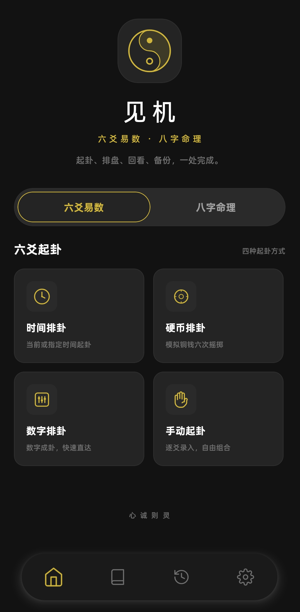
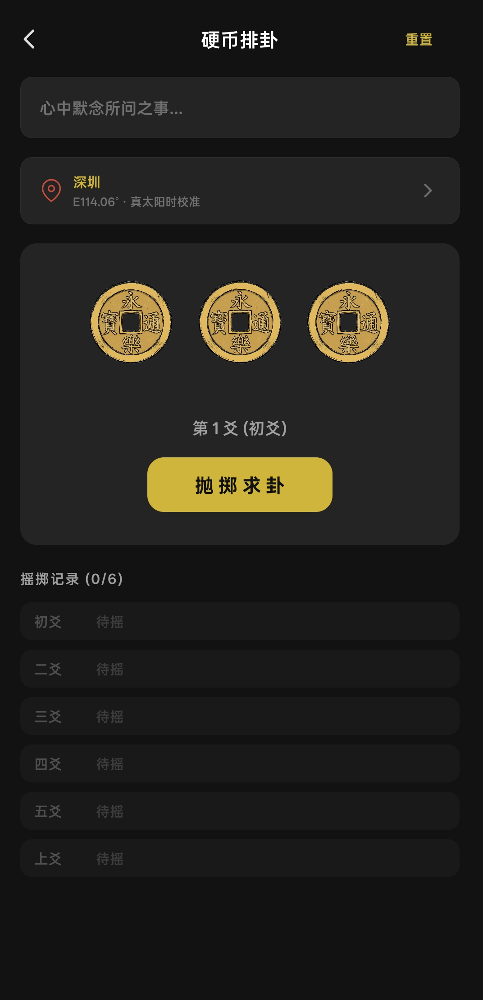

# 见机 Jianji

见机是一款基于 Expo + React Native 构建的跨平台易学排盘应用，当前覆盖六爻易数、八字命理、紫微斗数三条主业务链路，并统一提供历史记录、收藏筛选、备份恢复与 AI 辅助分析能力，支持在移动端与 Web 端完成完整的输入、排盘、回看与追问流程。

## 产品预览

<table>
  <tr>
    <td align="center">
      
    </td>
    <td align="center">
      
    </td>
    <td align="center">
      
    </td>
  </tr>
  <tr>
    <td align="center">首页</td>
    <td align="center">六爻起卦</td>
    <td align="center">八字排盘</td>
  </tr>
</table>

## 功能亮点

### 六爻易数

- 支持时间起卦、硬币排卦、数字排卦、手动起卦四种方式
- 支持地点经度输入，用于真太阳时修正
- 结果页提供本卦、变卦、动爻、四柱、旬空、神煞与月将信息
- 支持互卦、错卦、综卦查阅，支持收藏、删除与 Markdown 导出

### 八字命理

- 支持本地钟表时、平太阳时、真太阳时三种排盘口径
- 支持出生地、夏令时、子时归属、自定义参考时点等输入项
- 结果页覆盖基本信息、基本排盘、专业细盘三大视图
- 专业细盘支持流年大运 / 胎命身双面板，以及大运、流年、流月、小运联动

### 紫微斗数

- 支持公历 / 农历输入、出生地选择、夏令时开关与真太阳时校正
- 支持通行 / 中州算法、年界 / 运限界、晚子口径、天地人盘等配置项
- 结果页提供十二宫盘面、主星辅曜杂耀、亮度、三方四正、生年四化与运限摘要
- 支持大限、小限、流年、流月、流日、流时切换，以及历史记录重建命盘

### 数据与 AI

- 原生端使用 SQLite 持久化，Web 端自动降级到 `localStorage`
- 支持统一历史记录、收藏筛选、关键词搜索、按引擎分舱过滤、备份导出与恢复导入
- AI 对话支持流式回复、快捷追问、会话导出与结果回写
- 八字与紫微内置阶段式工作流：基础分析 -> 前事核验 -> 未来五年 -> 后续专题追问
- AI 接口采用用户自配的 OpenAI 兼容服务，出生地经纬度解析可选接入腾讯位置服务 Key

## 技术栈

- Expo SDK 54
- React Native 0.81
- React 19
- TypeScript 5.9
- Expo Router
- `expo-sqlite`
- `@react-native-async-storage/async-storage`
- `tyme4ts`
- `iztro`
- `@province-city-china/*`
- `react-native-sse`
- `react-native-svg`
- `react-native-reanimated`

## 仓库结构

```text
app/                         Expo Router 页面与路由
src/components/              通用组件与 AI / 弹层交互容器
src/core/                    六爻与八字纯计算核心
src/features/bazi/           八字结果页运行态与编辑辅助
src/features/ziwei/          紫微排盘适配层、视图模型、记录模型与亮度基线
src/db/                      三引擎记录、导入导出与兼容处理
src/services/                AI、设置、分享、地点与地理编码服务
src/hooks/                   页面级状态 Hook
src/theme/                   主题、配色与语义色 token
src/utils/                   历史筛选等轻量工具
src/polyfills/               运行时 polyfill
src/data/                    卦象、卦辞与静态资料
docs/images/                 README 展示截图
```

## 快速开始

### 环境要求

- Node.js 18+
- npm 9+

### 安装依赖

```bash
npm install
```

### 启动项目

```bash
npm run start
```

常用命令：

```bash
npm run android
npm run ios
npm run web
```

### 类型检查

```bash
npm run typecheck
```

### Git 防误传

首次克隆后执行：

```bash
npm run setup:hooks
```

仓库会在提交前和推送前阻止 `*.test.*`、`*.spec.*`、`__tests__`、`__localtests__` 以及常见测试配置文件进入版本库。临时本地实验建议放在仓库外，或放在未跟踪目录中。

## 数据与兼容

- 六爻、八字、紫微记录统一使用同一套 record envelope 存储
- 备份文件当前版本为 `version: 2`
- 导出备份默认不包含 API Key 与腾讯位置服务 Key
- Web 端会自动将旧版 `liuyao_records` 迁移到 `divination_records_v2`
- 旧八字记录会在读取、导出和导入时自动完成兼容补全
- 紫微导入记录当前仅接受中国标准时区 `UTC+8` 语义，导入时会清洗非法 AI 会话结构
- 根布局默认注入 `Intl.PluralRules` polyfill，保证 `iztro` 与相关格式化逻辑在多端一致运行

## 文档

- 架构文档：[PROJECT_ARCHITECTURE.md](./PROJECT_ARCHITECTURE.md)
- 紫微亮度基线说明：[src/features/ziwei/brightness/README.md](./src/features/ziwei/brightness/README.md)

## 开发说明

- 当前运行入口为 `expo-router/entry`
- 应用显示名与 Expo `slug` 为 `见机 / jianji`
- 原生数据库文件名沿用历史名称 `liuyao.db`
- 首页当前已统一提供六爻、八字、紫微三引擎入口
- 紫微链路基于 `iztro` 计算，并结合本地亮度基线、规则签名与缓存机制保证历史回放一致性

## 致谢

- `tyme4ts`：历法与时间计算能力基础库，[6tail/tyme4ts](https://github.com/6tail/tyme4ts)
- `IZTRO`：紫微斗数排盘与运限能力基础库，[SylarLong/iztro](https://github.com/SylarLong/iztro)
